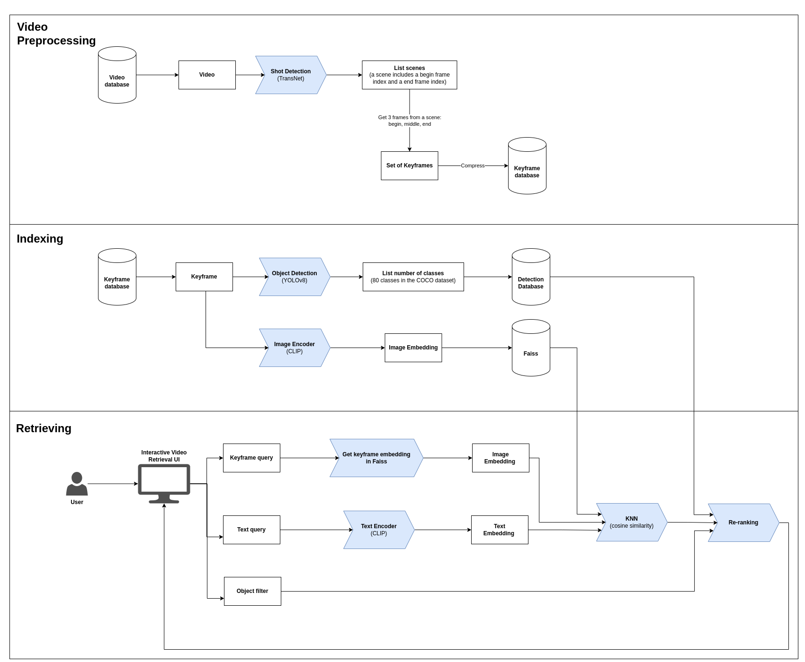
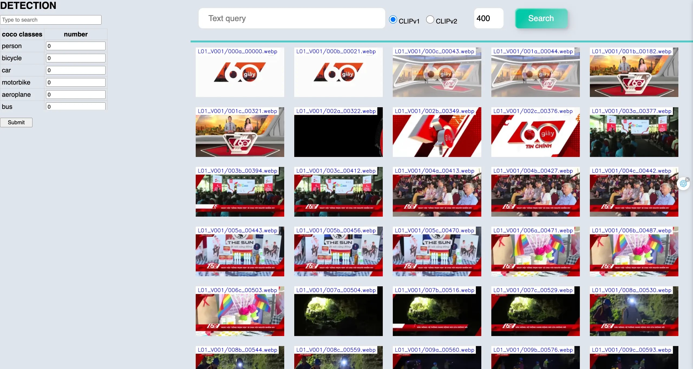

<h1 align="center"> Event Retrieval from Video - HCMAIC 2023 </h1>

1. Our team name: **Science AIO**
2. My roles: **Leader** - Researcher - Developer


## System pipeline




## Usage

### Setup 
```
conda create -n py38 python==3.8
conda activate py38
pip install git+https://github.com/openai/CLIP.git
pip install -r requirements.txt
```

### Data Preparation
- Download all the images [here](https://drive.google.com/drive/folders/1EJP0uWDaVjqCimJ1UYt4ztC8ZTaWvr10?usp=drive_link). We have applied various image compression methods. The results are compacted into 6GB.
- [account.txt](https://drive.google.com/file/d/11VoXuIiw7MxYNHzKdoopozZZX-m2XfEE/view?usp=drive_link): is used for login and submission.
- [dataframe_Lxx.csv](https://drive.google.com/file/d/17jBbCQOeCOdh769WZBSmLms3snje69jC/view?usp=drive_link): detection database

You can choose 1 of the following 3 versions for testing.
| version | description | json | faiss bin v1 | faiss bin v2 |
| --- | --- | --- | --- | --- |
| **full** | contains 3 frames in each scene (begin, middle, end) | [full_path_v1.json](https://drive.google.com/file/d/1YbipK87AwlZGudSjCHBGizvXrAIERr-Z/view?usp=drive_link) | [full_faiss_v1.bin](https://drive.google.com/file/d/1TmCTNf4tVzoAf0OFwn8Yz9DVd2YDUEK-/view?usp=drive_link) | [full_faiss_v2.bin](https://drive.google.com/file/d/11TqwesPU7lQMY0RpzI8vcfXnXuxt6X4J/view?usp=drive_link) |
| **standard** | contains 2 frames in each scene (begin, end) | [full_path_v3.json](https://drive.google.com/file/d/1M2ahFPjo3LCopDSlJMe-MThhjultMITh/view?usp=drive_link) | [full_faiss_v3.bin](https://drive.google.com/file/d/1LEuLqzBEda64rMkxf4j6K-DR-Lt1neTR/view?usp=drive_link) | [full_faiss_v4.bin](https://drive.google.com/file/d/1W4V67eg6ukrw0ZSyy5Ra02oXliot45JY/view?usp=drive_link) |
| **lightweight** | contains 1 frame in each scene (middle) | [full_path_v5.json](https://drive.google.com/file/d/1Vkz1IXbITBxfHGsMMm0RQEwRab5oFf0U/view?usp=drive_link) | [full_faiss_v5.bin](https://drive.google.com/file/d/1fokDFA7u7MoSNozWuXwqOvBZxUB8tmg_/view?usp=drive_link) | [full_faiss_v6.bin](https://drive.google.com/file/d/14Mh7dga1ROOhHSHjk_qJ0FsDioWxulRE/view?usp=drive_link) |

### Run 
```
python app.py
```

Run this URL in your browser: http://0.0.0.0:5001/home?index=0



_Note_: I use 2 versions of CLIP to increase the diversity of displayed results.


## Documents
### Faiss
1. Faiss: Facebook AI Research Search Similarity ([Docs](https://faiss.ai/index.html))

### CLIP and Prompt Engineering for CLIP
1. Learning Transferable Visual Models From Natural Language Supervision - 2021 ([Paper](https://arxiv.org/pdf/2103.00020.pdf) - [GitHub](https://github.com/openai/CLIP) - [Blog](https://openai.com/research/clip))
2. How to Try CLIP: OpenAI's Zero-Shot Image Classifier ([Blog](https://blog.roboflow.com/how-to-use-openai-clip))
3. Learning to Prompt for Vision-Language Models - CoOp - 2022 ([Paper](https://arxiv.org/pdf/2109.01134.pdf))
4. Towards Robust Prompts on Vision-Language Models - 2023 ([Paper](https://arxiv.org/pdf/2304.08479.pdf))
5. Prompt Engineering: The Magic Words to using OpenAI's CLIP - 2021 ([Blog](https://blog.roboflow.com/openai-clip-prompt-engineering))
   
### TransNet
1. TransNet: A Deep Network for Fast Detection of Common Shot Transitions ([GitHub](https://github.com/soCzech/TransNet))
2. TransNet V2: Shot Boundary Detection Neural Network ([GitHub](https://github.com/soCzech/TransNetV2/tree/master))
